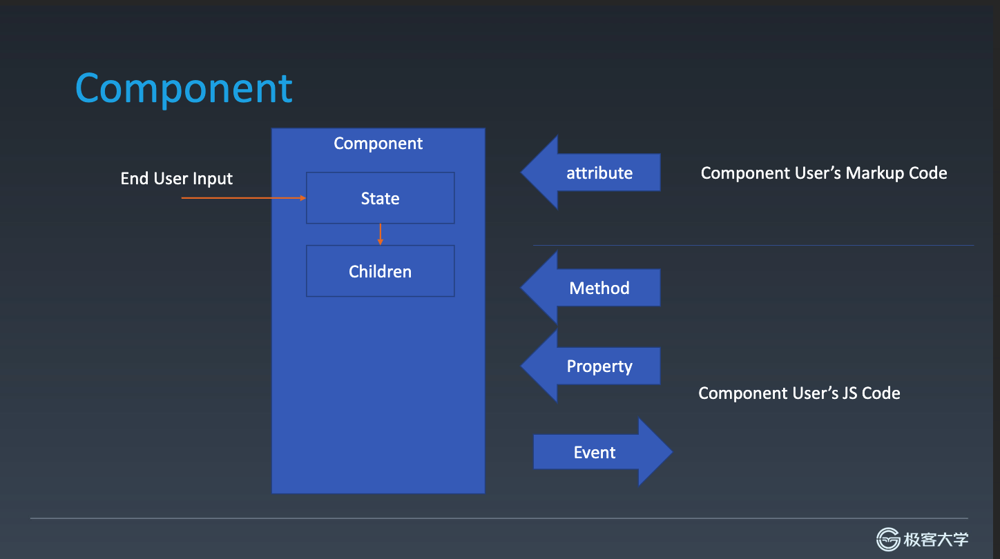
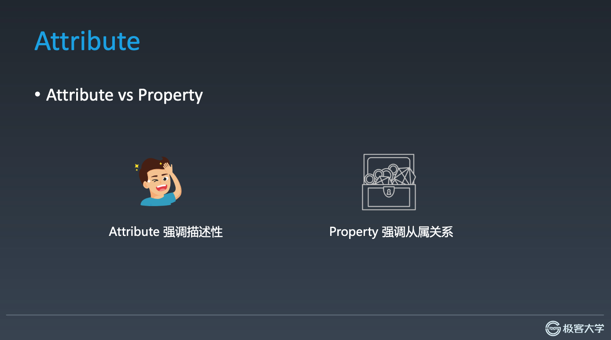
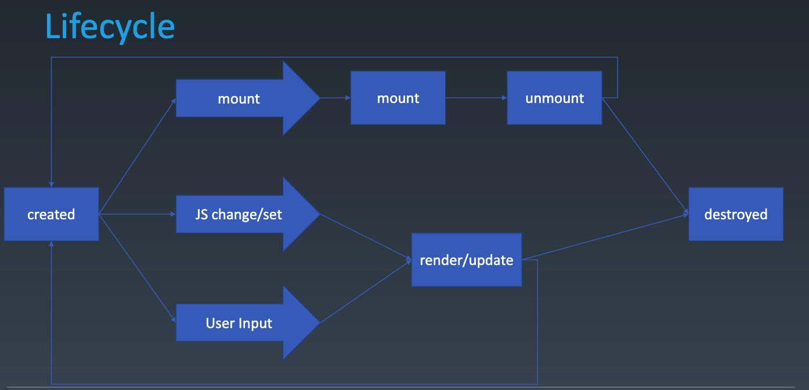

### 组件化基础

1. 前端的架构问题80%是要去解决组件问题，其他的架构问题就是架构设计模式 加上零碎的基础库问题

### 前端架构问题（架构主体需求）
1. 组件化问题

2. 架构设计模式问题

3. 基础库问题

下沉（flutter基于webgl做）

### 对象与组件

**对象**
  - Properties
  - Methods
  - Inherit（继承关系）

**组件**
  - Properties
    - 属于组件原型属性，需要组件的原型赋值
  - Methods
    - 抽象出来的组件行为，用于改变组件状态，交互
  - Inherit
    - 可以继承原型的能力
  - Attribute（自生属性）
    - 自生的固有属性，静态属性
  - Config & State
    - 组件相关配置，和组件一些发生状态
  - Event
    - 组件时间变化，触发交互
  - lifecycle
    - 组件生命周期，处理组件产生到销毁，可以在这之间做很多回调方法作为钩子
  - Children
    - 子类

一个组件不一定需要所有要素，但是构建组件化这些都是必要的
看图，看一下组件必要元素的一些关系


组件内部： 只有state和Children，只会受到一种来源的改变。比如终端用户的输入

attribute Methods Property Event都属于组件使用者和组建的作者交互的方式（也可以理解为组建的外部参数的一种感觉）

component User‘s 组件（Markup Code）装饰代码，有的可以用字符串，JSX template， 标记语言等等。一般都是字符串。
react jsx允许attribute不是字符串

componet User’s Js code 来编写 Methods Property 和 Event
通过事件把状态提出去

### Attribute

### Attribute vs Property
一般都会翻译成属性，有时候Attribute会翻译特性
- Attribute 强调描述性(帅不帅啥的) XMl 对一个组件的描述
- Property 强调从属关系(财产)，属于对象的一部分

Attribute

```JS
<my-component attribute="V"/>
myComponent.getAttribute("a")
myComponent.setAttribute('a', "value")
// 可以在html定义值
// 也可以在js上
```

Property:
```JS

myComponent.a = 'vlaue'
// 只能在js上改变值

```
**Attribute vs Property**
```html
<input value="cute"/>
<script>
var input = document.getElementByTagName('input')
// 若property没有设置，则结果是Attribute 
input.value // cute
input。getAttribute('value'); // cute

input.value = 'hello';// 若value属性已经设置，则attribute不变，
property变化，元素上实际的效果是property优先
input.value // HELLO
input.getAttribute('value') // cute
```
### 如何设计组件状态
| Markup set | JS set | JS change| User Input||
| ----|----| ----| ----| ----|
|❌|✅|✅|？|**property**|
|✅|✅|✅|？|**attribute**|
|❌|❌|❌|✅|**state**|
|❌|✅|❌|❌|**config**|

- property 可以js 代码去改变值，也可以通过事件
- attribute 可以直接在标记语言上改变，也可以通过js 还可以是用户交互发生改变
- state只能用户交互发生改变
- config只要js代码设置发生改变，一般是组件的全局性的要素（构造函数里面）

组件的大体结构
```JS

class MyComponent {
  // config都是全局属性,写死的常量
  constructor(config) {
    this.state = {
      i: 1
    }
  }
  get prop1() {

  }

  set prop1() {

  }

  setAttribute(attr) {

  }
  getAttribute(attr, value) {

  }
  get children() {

  }
  set children(){}
  mounted() {

  }
  render() {}
}
<MyComponent attr1="33">
```

组件是UI范畴的东西
### lifecycle

组件有两个身不由己的时候 创建 和 销毁 在之间就有很多生命周期

在created 到 distroyed之间的过程中就会做很多事情

比如mount 挂载节点 在这个节点之前都是没有cssom的

mount 到unmount都会多次发生。

还有我们通过JSchange/set和User Input在改变组件的 attribute和property的时候，还是需要去更新（update）渲染（render）组件

### 组件化思想放入脑子里

不管怎么包装组件，组件都需要这些要素（Properties，methods Inherit，state/config attribute，event, lifeCycle ）,  而且能够了解他们之间的关系，不管
使用什么框架来编写组件，或者写一个框架库都需要知道这些要素。

ng react vue都是具备这些思想 react的props等效于config

要不要让props和config为同一个属性，和props与attribute为一个属性都值得自己去研究

### Children

- content型Children与Template 型Children
模板children和content children需要区分开来

### 案例Carousel

- state
  - activeIndex
- property
  - loop time imgList autoplay color forward
- attribute
  - 分析分析会不会与property一样。 startIndex（只用一次）loop time imgList autoplay color forward
- children
  - 2
- event
  - change click hover swipe resize
- method
  next() prev() goto()
  play() stop()
- config
  - useRAF
  - UsesetInterval(tick, 16)
  - userTimeout

组件化本质就是需要思考设计这些属性有哪些内容，不管是使用vue或者使用react或者使用自己的编译语言。所有组件的结构都是基于此。
设计好一个组件之后，就应该去思考怎么设计和实现代码，组件可以更好地维护和阅读。还有一个很重要的目的就是组件编写的时候，一定重视
设计组件的api，这个决定了你组建的使用的难易度。

### 组件化添加jSX语法

outline: 设置边框的时候不影响布局

- 轮播图 （carousel，是一个循环的东西）
  1. 一种是整体移动 
     -  存在一个一直transform，最后的transform的面基越来越大。在一些实现不好的浏览器就会导致一些性能损耗
  2. 一种是两张一起移动


#### 拖拽
#### 滚动过程中拖拽过快


